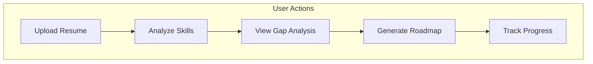
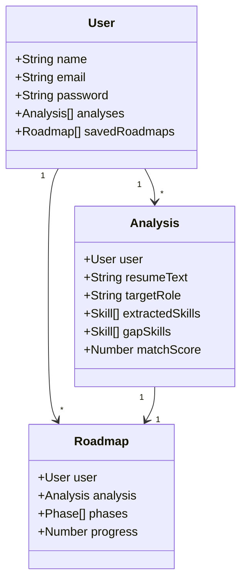

# UML Diagrams

This directory contains UML diagrams for the SkillLens application.

## Available Diagrams

### 1. Use Case Diagram
- Shows user interactions with the system
- Main actors: Guest, User, Admin

### 2. Class Diagram
- Shows data models and relationships
- User, Analysis, Roadmap entities

### 3. Sequence Diagrams
- Resume Analysis Flow
- Authentication Flow
- Roadmap Generation Flow

### 4. Component Diagram
- Shows system components and interactions
- Frontend, Backend, NLP Service, Database

## Creating Diagrams

You can use the following tools to create/edit diagrams:
- [draw.io](https://draw.io) - Free online diagramming
- [Mermaid](https://mermaid.js.org/) - Markdown-based diagrams
- [PlantUML](https://plantuml.com/) - Text-based UML

## Mermaid Examples

### Use Case (embed in markdown)

### Class Diagram

